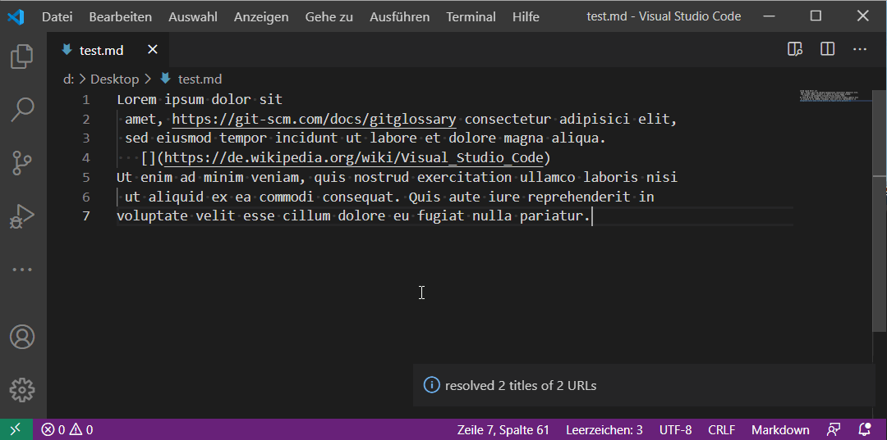

Resolves selected URLs of one or more HTML pages and uses the document title(s) to format Markdown links

# Features

-   Works with all plain URLs and Markdown links without text (e.g. ``) in selection
-   Requests HTML pages to extract title HTML elements
-   Sanitizes title text (trim and compact whitespace, replace HTML entities)
-   Summary after completion

# Installation

## Web

1.  Visit the [extensions page](https://marketplace.visualstudio.com/items?itemName=Capybara1.vscode-url-title-resolver)
    on the Visual Studio Marketplace
2.  Select Install

## VSCode

1.  Press `F1` and type `Extensions: Install Extensions`
2.  Search for `vscode-url-title-resolver`
3.  Select `install`

# Quick Start

1.  [Install](#installation) extension into VSCode and reload
2.  Create or open an existing Markdown file
    and ensure it contains least one plain URL
3.  Select text, inclding the URL(s)
4.  Open Command Palette and select _Resolve title for URL(s)_
5.  Wait until completions of the command execution and
    review the summary shown in a notification

# Main Project Dependencies

-   [axios](https://github.com/axios/axios): For HTTP request handling

# Known Issues

-   _None_

# Release Notes

See [CHANGELOG](./CHANGELOG.md)

# Latest Version

Please visit the [release page](./releases/) for details
